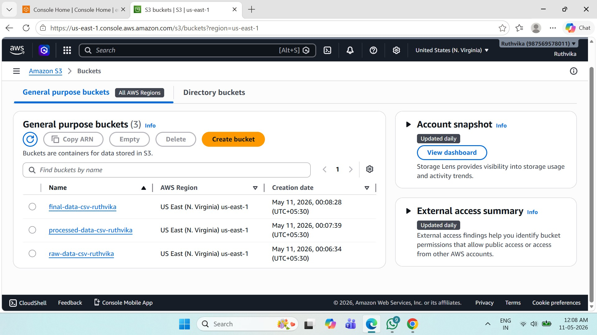
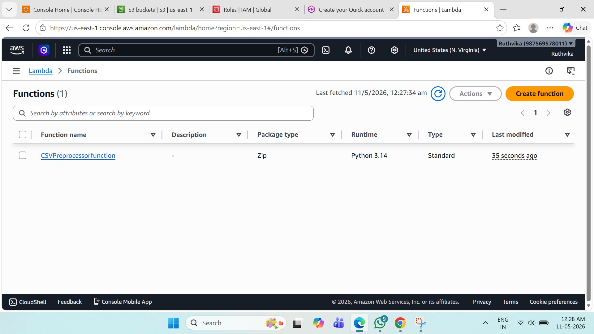
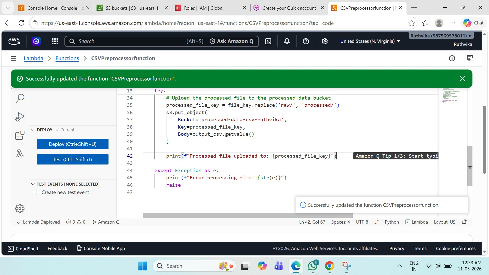
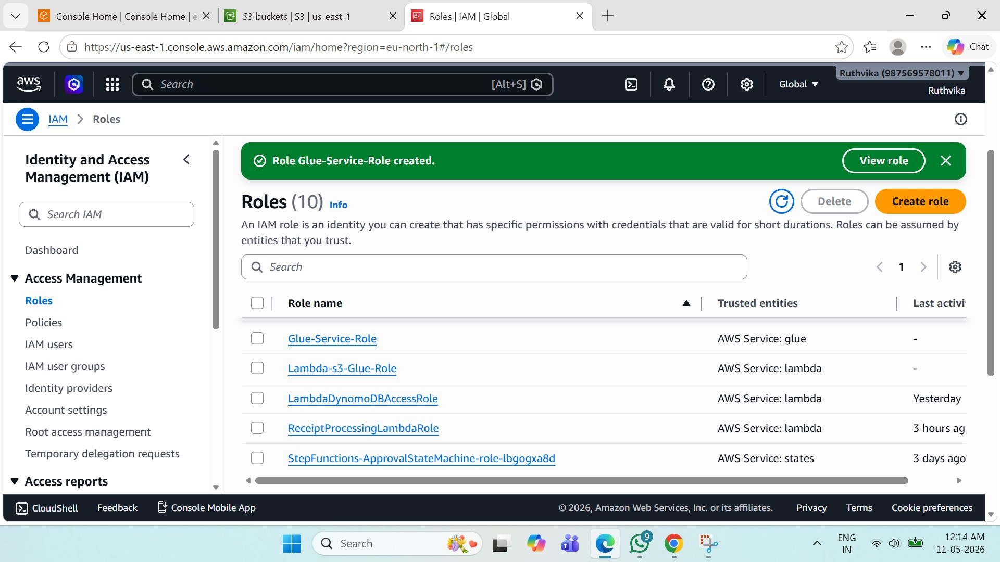
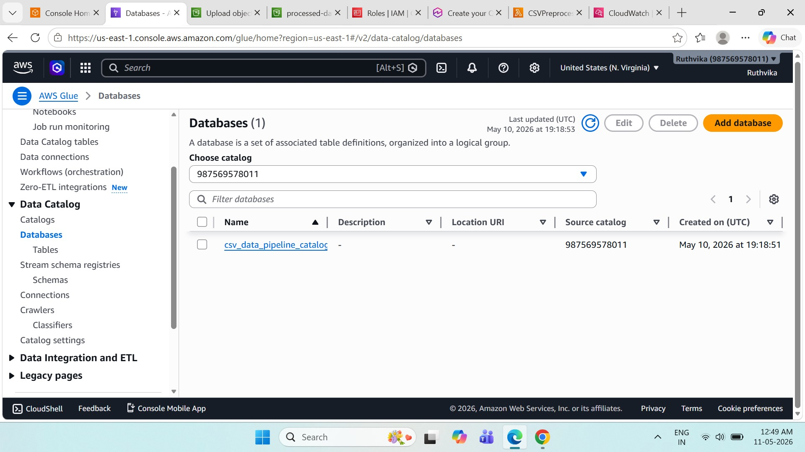
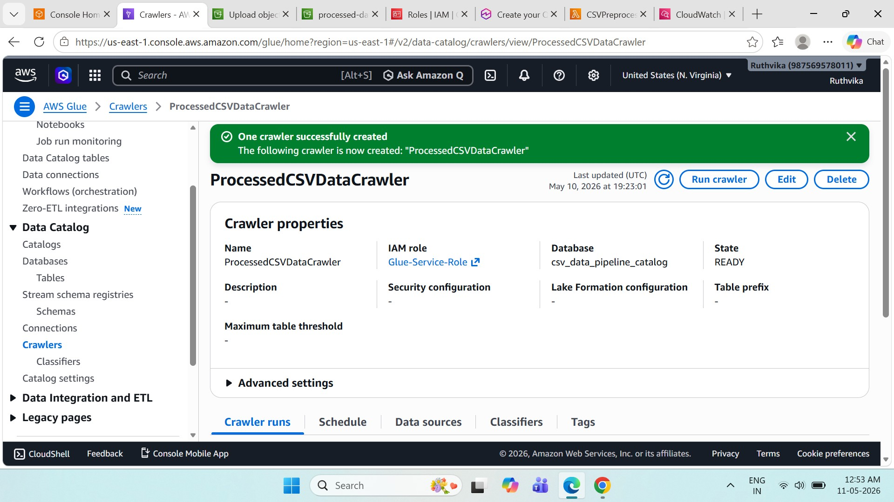
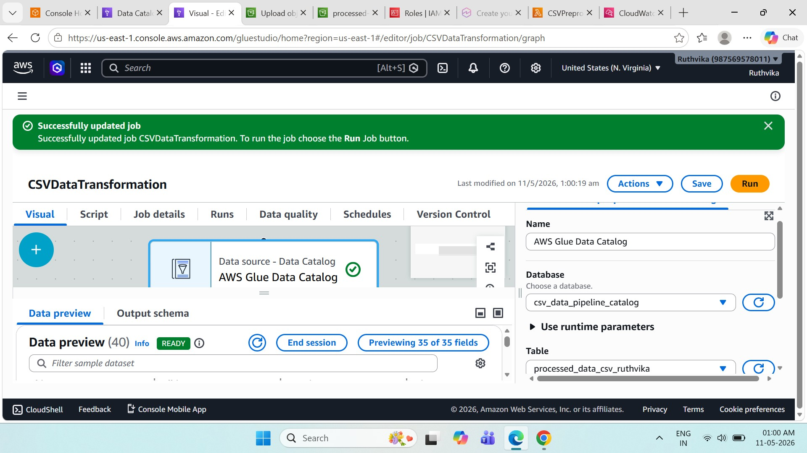
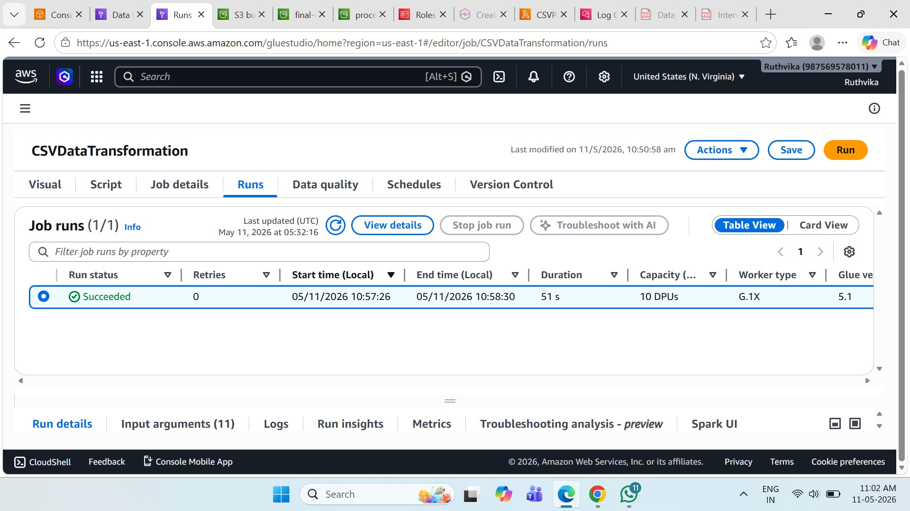

# Data Pipeline for Processing CSV Files Using S3 Lambda Glue and QuickSight

# Serverless CSV Data Processing Pipeline using AWS

This project demonstrates an end-to-end serverless data pipeline using AWS services such as Amazon S3, AWS Lambda, AWS Glue, IAM, and CloudWatch.

The pipeline automatically processes uploaded CSV files, transforms the data, stores processed files in Amazon S3, and catalogs the data using AWS Glue.

---

# Architecture Workflow

1. Upload raw CSV file to Amazon S3
2. AWS Lambda function is triggered automatically
3. Lambda preprocesses and cleans CSV data
4. Processed CSV is stored in another S3 bucket
5. AWS Glue Crawler scans processed data
6. AWS Glue Data Catalog stores schema metadata
7. AWS Glue Visual ETL transforms the dataset
8. CloudWatch monitors logs and execution

---

# AWS Services Used

- Amazon S3
- AWS Lambda
- AWS Glue
- AWS Glue Crawler
- AWS Glue Data Catalog
- AWS IAM
- Amazon CloudWatch

---

# Project Screenshots

## 1. Amazon S3 Buckets



---

## 2. Lambda Function Creation



---

## 3. Lambda CSV Preprocessor Function Code



---

## 4. IAM Role Configuration



---

## 5. AWS Glue Database



---

## 6. AWS Glue Crawler



---

## 7. AWS Glue Visual ETL



---

## 8. AWS Glue Job Run Success



---

# Features

- Automated CSV preprocessing
- Serverless event-driven architecture
- Data cleaning and transformation
- AWS Glue Data Catalog integration
- ETL workflow automation
- Cloud-native scalable pipeline

---

# Folder Structure

```text
project/
│
├── lambda/
│   └── lambda_function.py
│
├── sample-data/
│   └── sample.csv
│
├── screenshots/
│   ├── bucket_creation.jpg
│   ├── lambda_function_creation.jpg
│   ├── lambda_csvpreprocessor_function_code.jpg
│   ├── iam_role_created.jpg
│   ├── awsglue_database_created.jpg
│   ├── aws_crawlers_processedcsvdatacrawler.jpg
│   ├── visual_ETL_created.jpg
│   └── csvdatatransformation_runsucceeded.jpg
│
└── README.md
```

---

# Future Enhancements

- QuickSight dashboard integration
- Real-time analytics
- Athena query integration
- Automated reporting pipeline

---

# Author

Ruthvika Salgare


## Note on QuickSight

Amazon QuickSight integration is optional in this project.

Due to QuickSight account activation issues, this project currently focuses on the serverless CSV processing pipeline using:

- Amazon S3
- AWS Lambda
- AWS Glue
- IAM
- CloudWatch

The processed CSV files are successfully stored in the target S3 bucket. QuickSight can be connected later to create dashboards and visualizations from the processed data.
